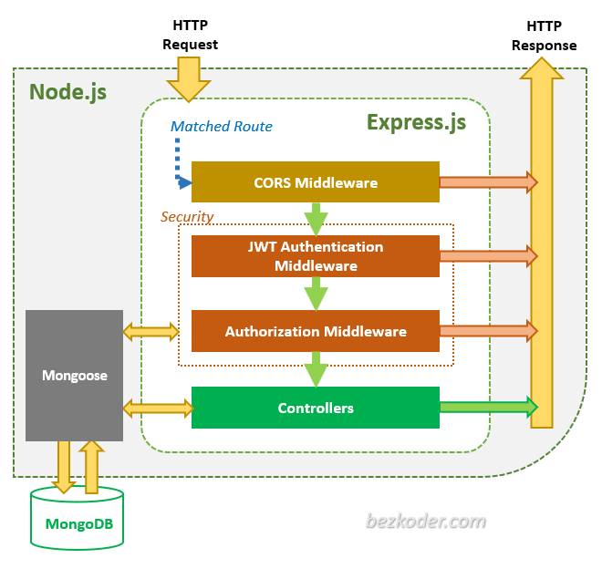

# API Node Server + Vanilla js Front

A boilerplate/starter project for quickly building RESTful APIs using Node.js, Express, and Mongoose.

## Start

To start client server:

```bash
npm run dev:cliente
```

To start server server:

```bash
npm run dev:servidor
```

Install the dependencies:

```bash
npm install
```

## Features

- **NoSQL database**: [MongoDB](https://www.mongodb.com) object data modeling using [Mongoose](https://mongoosejs.com)
- **Authentication and authorization**: using [passport](http://www.passportjs.org)

## API

port: 3000

### API Endpoints

List of available routes:

**Auth routes**:\
`POST /api/login` - login

**User routes**:\
`POST /api/users` - create a user\
`GET /api/users` - create a users\
`GET /api/users/:userId` - get user

## Front

port: 3001

## Dependencies

- **Bootstrap**: [bootstrap](https://getbootstrap.com/)

## Auth



